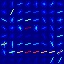
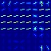

# Vehicle Detection for Self-Driving Cars

The goal of this project is to produce a robust pipeline for detecting vehicles from a front-facing camera on a car. The pipeline should output a visual display of bounding boxes around each detected car.

   

## Files and Usage

1. combine_data.py
    * Contains code for combining all image file names from the different data sources to make extracting data during training easy.
    * `python combine_data.py` will save the combined data in data/cars.txt and data/non_cars.txt.
2. features.py
    * Contains code for extracting the features on which to train a classifier for detecting cars.
    * `python features.py` will save the features in separate files named car_features.p and noncar_features.p
3. classifier.py
    * Contains code for training a linear SVM classifier on the extracted car and non-car features.
    * `python classifier.py` will save the classifier and scaler to use when making predictions.
4. visualize.py
    * Contains code for visualizing different features, heatmaps, and bounding boxes from test images.
    * `python visualize.py` will save images as described above in the output_images folder.
5. detect_cars.py
    * Contains code for detecting vehicles using the trained classifier and drawing bounding boxes around them in a video.
    * `python detect_cars.py` will run the classifier on project_video.mp4 and save a new video named project_video_output.mp4 with bounding boxes drawn around detect cars.

## Solution

### Overview

The steps taken to complete this project are as follows:

* Perform feature extraction using Histogram of Oriented Gradients (HOG), apply a color transform and append binned color features, as well as histograms of color, to the HOG feature vector.
* Train a Linear Support Vector Machine (SVM) classifier on the extracted features.
* Implement a sliding-window technique with the trained classifier to detect vehicles in an image.
* Create a heatmap of recurring detections to reject outliers.
* Output visual display of bounding boxes around detected vehicles in a video stream.

### Feature Extraction

The first step of the pipeline is to identify and extract features from the data, which we can then train a classifier on to predict the presence of vehicles in an image. The dataset is a combination of the [GTI vehicle image database](http://www.gti.ssr.upm.es/data/Vehicle_database.html), the [KITTI vision benchmark suite](http://www.cvlibs.net/datasets/kitti/), and examples extracted from the project video itself. The data is split into vehicles and non-vehicles subsets, and examples of a vehicle image (left) and non-vehicle image (right) can be seen below:

   

Features were extracted using a combination of Histogram Of Gradients (HOG), spatial binning of the color image, and histogram of pixel intensity (color histogram). The HOG features were found using the sklearn `hog()` function, and the parameters used were found by trial and error. Some of the parameters I found to be most effective were: `orient=9`, `pixels_per_cell=(8, 8)`, and  `cells_per_block=(2, 2)`. The code for extracting the HOG features can be found on lines 9-26 of the `features.py` file. The function `bin_spatial()` was used to resize the images to 32x32 resolution and transform it into a vector, and the code can be found on lines 29-33 of the `features.py` file. The code for creating a color histogram of the images can be found in the function `color_hist()` on lines 36-43 of the `features.py` file. I wrapped all of these functions in the `extract_features()` function, which outputs one feature vector for each image. A visualization of HOG features of a vehicle (left) and non-vehicle (right) can be seen below:

      

### Train a Classifier

