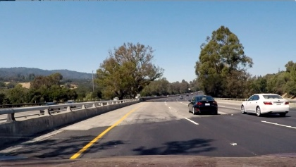

# Vehicle Detection for Self-Driving Cars

The goal of this project is to produce a robust pipeline for detecting vehicles from a front-facing camera on a car. The pipeline should output a visual display of bounding boxes around each detected car.

   

## Files and Usage

1. combine_data.py
    * Contains code for combining all image file names from the different data sources to make extracting data during training easy.
    * `python combine_data.py` will save the combined data in data/cars.txt and data/non_cars.txt.
2. features.py
    * Contains code for extracting the features on which to train a classifier for detecting cars.
    * `python features.py` will save the features in separate files named car_features.p and noncar_features.p
3. classifier.py
    * Contains code for training a linear SVM classifier on the extracted car and non-car features.
    * `python classifier.py` will save the classifier and scaler to use when making predictions.
4. visualize.py
    * Contains code for visualizing different features, heatmaps, and bounding boxes from test images.
    * `python visualize.py` will save images as described above in the output_images folder.
5. detect_cars.py
    * Contains code for detecting vehicles using the trained classifier and drawing bounding boxes around them in a video.
    * `python detect_cars.py` will run the classifier on project_video.mp4 and save a new video named project_video_output.mp4 with bounding boxes drawn around detect cars.

## Solution

### Overview

The steps taken to complete this project are as follows:

* Perform feature extraction using Histogram of Oriented Gradients (HOG), apply a color transform and append binned color features, as well as histograms of color, to the HOG feature vector.
* Train a Linear Support Vector Machine (SVM) classifier on the extracted features.
* Implement a sliding-window technique with the trained classifier to detect vehicles in an image.
* Create a heatmap of recurring detections to reduce false positives.
* Output visual display of bounding boxes around detected vehicles in a video stream.

### Feature Extraction

The first step of the pipeline is to identify and extract features from the data, which we can then train a classifier on to predict the presence of vehicles in an image. The dataset is a combination of the [GTI vehicle image database](http://www.gti.ssr.upm.es/data/Vehicle_database.html), the [KITTI vision benchmark suite](http://www.cvlibs.net/datasets/kitti/), and examples extracted from the project video itself. The data is split into vehicles and non-vehicles subsets, and examples of a vehicle image (left) and non-vehicle image (right) can be seen below:

   

Features were extracted using a combination of Histogram Of Gradients (HOG), spatial binning of the color image, and histogram of pixel intensity (color histogram). The HOG features were found using the sklearn `hog()` function, and the parameters used were found by trial and error. Some of the parameters I found to be most effective were: `orient=9`, `pixels_per_cell=(8, 8)`, and  `cells_per_block=(2, 2)`. The code for extracting the HOG features can be found on lines 9-26 of the `features.py` file. The function `bin_spatial()` was used to resize the images to 32x32 resolution and transform it into a vector, and the code can be found on lines 29-33 of the `features.py` file. The code for creating a color histogram of the images can be found in the function `color_hist()` on lines 36-43 of the `features.py` file. I wrapped all of these functions in the `extract_features()` function, which outputs one feature vector for each image. A visualization of HOG features of a vehicle (left) and non-vehicle (right) can be seen below:

      

### Train a Classifier

Once the features were extracted from the images, I used them to train a classifier for detecting vehicles in an image. I used a Linear SVM as my classifier, feeding in the normalized feature vectors for vehicles and non-vehicles. Normalization was performed using the sklearn `StandardScaler()` function. The data was also selected randomly using the sklearn `train_test_split()` function, and 10% of the data was held out as the test set. All of the code for training the classifier can be found in the `classifier.py` file.

### Detect Vehicles In Unseen Images

I implemented a sliding window technique to search a portion of an image to predict whether or not a vehicle was present. In order to increase efficiency, I reduced the search area by setting a region of interest which excluded the top half of the image, and also reduced the image size by 1.5. As the window slides along the search area, the classifier is used to predict whether or not a vehicle is present based on the features in that sample. The code for detecting cars can be found in the `find_cars()` function on lines 23-86 of the `detect_cars.py` file.

### Reduce False Positives

In order to reduce false positives, and make the bounding boxes more consistent and smoother between frames of a video stream, I used a heatmap of the positive detections reported by the classifier. I keep an average of the heatmaps over 15 frames of video, and use a threshold to remove false positives. The scipy `label()` function was used to identify "blobs" in the heatmap, which correlated to vehicles in the image. The code for adding the detections to the heatmap can be found on line 84 of the `detect_cars.py` file, and the function which applies the threshold can be found on lines 89-92 of the same file. An example of an input image (left) and a heatmap applied to that image (right) is shown below:

   

### Visual Display

Bounding boxes are displayed on the images around detected cars using the `draw_labeled_bboxes()` function in the `detect_cars.py` file. This function is passed the labels aka blobs of the heatmaps mentioned above. By using an average of the heatmaps over 15 frames of video, the result is a smooth and consistent bounding box around vehicles without any false positives in the project video.

### Discussion

Although this pipeline works well on the project video, it does not process the video in real time, so it is currently not a suitable production pipeline. My machine was able to process the video at only 5 frames per second. I plan to explore more modern approaches which are able to perform detection in real time, such as SSD and YOLO. Another issue my pipeline faces is detecting cars which are occluded by another vehicle. There is a segment of the project video where two cars driving next to each other are detected as one vehicle, producing only one bounding box around the two cars. Finally, my pipeline currently does not detect vehicles which are relatively far away. Ideally the pipeline should be able to detect any car in the camera's view, just as humans are able to see what traffic is doing up ahead.

